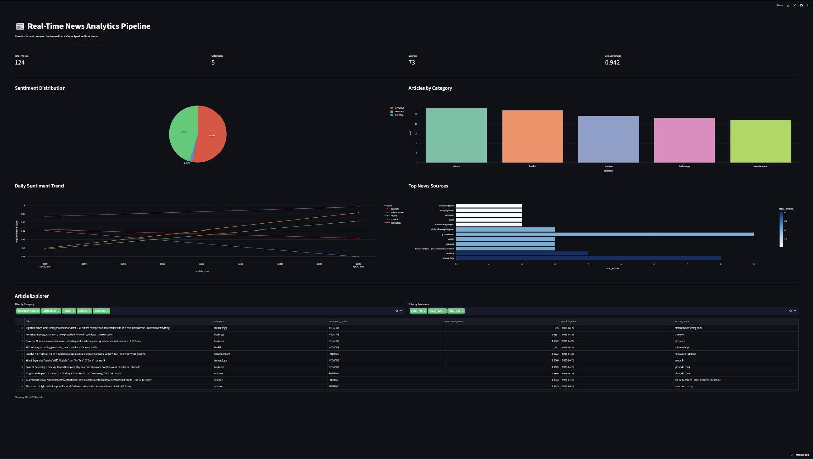

# 📰 Real-Time News Analytics Pipeline


> An end-to-end real-time data engineering pipeline that ingests live news articles, streams them through Apache Kafka, processes with PySpark, enriches with AI sentiment analysis, and serves insights via a live public dashboard.

🔴 **[Live Dashboard →](https://news-analytics-pipeline-kirthic.streamlit.app/)**

---

## 📸 Dashboard Preview



---

## 🏗️ Architecture

```
NewsAPI (5 categories)
        │
        ▼
Kafka Producer (Python · 30min polls · 90+ articles/cycle)
        │
        ▼
Apache Kafka  ──  raw_news topic · 3 partitions
        │
        ▼
PySpark Structured Streaming 3.5.0
        │
        ▼
Cloudflare R2 ── 🥉 Bronze Layer (JSON · partitioned by category)
        │
        ▼
PySpark Cleaner  (dedup · null handling · timestamp normalization)
        │
        ▼
Cloudflare R2 ── 🥈 Silver Layer (Snappy Parquet)
        │
        ▼
DistilBERT Sentiment Enricher (HuggingFace · POSITIVE/NEGATIVE/NEUTRAL)
        │
        ▼
Cloudflare R2 ── 🥇 Gold Layer (Enriched Snappy Parquet)
        │
        ▼
PostgreSQL 15 (Docker · raw_gold_articles)
        │
        ▼
dbt 1.11.8  ──  stg_articles · dim_sources · fact_articles · agg_daily_trends
        │
        ▼
Neon Serverless PostgreSQL (Cloud · Singapore)
        │
        ▼
Streamlit Dashboard  ──  🔴 Live at streamlit.app
```

> Orchestrated end-to-end by Apache Airflow 2.9.0

---

## 🚀 Live Demo

**[https://news-analytics-pipeline-kirthic.streamlit.app/](https://news-analytics-pipeline-kirthic.streamlit.app/)**

The dashboard shows:
- **KPI Metrics** — total articles, categories, sources, avg sentiment score
- **Sentiment Distribution** — POSITIVE / NEGATIVE / NEUTRAL pie chart
- **Articles by Category** — technology, business, science, health, entertainment
- **Daily Sentiment Trend** — per-category sentiment over time
- **Top News Sources** — most active publishers
- **Article Explorer** — filterable, searchable article table

---

## 🛠️ Tech Stack

| Layer | Technology |
|-------|-----------|
| Ingestion | NewsAPI, Apache Kafka 7.4.0, Zookeeper |
| Stream Processing | PySpark 3.5.0 Structured Streaming |
| Object Storage | Cloudflare R2 (S3-compatible, medallion architecture) |
| Orchestration | Apache Airflow 2.9.0 |
| Batch Processing | PySpark |
| AI / NLP | HuggingFace DistilBERT |
| Data Warehouse | PostgreSQL 15 (Docker), Neon Serverless |
| Transformation | dbt 1.11.8 |
| Visualization | Streamlit, Plotly, Metabase |
| Infrastructure | Docker, Docker Compose, WSL2 Ubuntu 24.04 |
| Language | Python 3.12 |

---

## 📁 Project Structure

```
news-analytics-pipeline/
├── ingestion/
│   ├── kafka_producer.py              # NewsAPI → Kafka topic
│   └── spark_streaming_consumer.py   # Kafka → R2 bronze layer
├── transformation/
│   ├── pyspark_cleaner.py             # Bronze → Silver
│   ├── sentiment_enricher.py          # Silver → Gold (DistilBERT)
│   ├── postgres_loader.py             # Gold → PostgreSQL
│   └── neon_sync.py                   # PostgreSQL → Neon cloud
├── airflow/dags/
│   └── news_pipeline_dag.py           # Airflow DAG (clean → sentiment → sync)
├── news_pipeline/                     # dbt project
│   └── models/
│       ├── staging/
│       │   └── stg_articles.sql
│       └── marts/
│           ├── dim_sources.sql
│           ├── fact_articles.sql
│           └── agg_daily_trends.sql
├── dashboard/
│   └── app.py                         # Streamlit dashboard
├── docs/                              # Screenshots for README
├── docker-compose.yml                 # Kafka + PostgreSQL + Metabase
└── .env.example                       # Environment variable template
```

---

## ⚙️ Setup & Run

### Prerequisites
- Windows 11 + WSL2 Ubuntu 24.04
- Docker Desktop with WSL2 integration enabled
- Python 3.12 + uv
- Java 17

### 1. Clone and install
```bash
git clone https://github.com/Kirthic-Adhithya/news-analytics-pipeline.git
cd news-analytics-pipeline
uv venv .venv && source .venv/bin/activate
uv pip install -r requirements.txt
```

### 2. Configure environment
```bash
cp .env.example .env
# Fill in your API keys and credentials
```

### 3. Download Spark JARs
```bash
mkdir -p infra/jars && cd infra/jars
wget https://repo1.maven.org/maven2/org/apache/spark/spark-sql-kafka-0-10_2.12/3.5.0/spark-sql-kafka-0-10_2.12-3.5.0.jar
wget https://repo1.maven.org/maven2/org/apache/hadoop/hadoop-aws/3.3.4/hadoop-aws-3.3.4.jar
wget https://repo1.maven.org/maven2/com/amazonaws/aws-java-sdk-bundle/1.12.262/aws-java-sdk-bundle-1.12.262.jar
wget https://repo1.maven.org/maven2/org/apache/kafka/kafka-clients/3.4.0/kafka-clients-3.4.0.jar
wget https://repo1.maven.org/maven2/org/apache/commons/commons-pool2/2.11.1/commons-pool2-2.11.1.jar
wget https://jdbc.postgresql.org/download/postgresql-42.7.3.jar
```

### 4. Start infrastructure
```bash
docker compose up -d
```

### 5. Run the pipeline
```bash
# Ingest
python ingestion/kafka_producer.py
python ingestion/spark_streaming_consumer.py

# Transform (or trigger via Airflow)
python transformation/pyspark_cleaner.py
python transformation/sentiment_enricher.py
python transformation/postgres_loader.py
python transformation/neon_sync.py
```

### 6. Run dbt models
```bash
cd news_pipeline
dbt run
dbt test
```

### 7. Launch dashboard locally
```bash
streamlit run dashboard/app.py
```

---

## 📊 dbt Models

| Model | Materialisation | Description |
|-------|----------------|-------------|
| `stg_articles` | View | Cleaned and normalised articles from gold layer |
| `dim_sources` | Table | Unique news sources with article counts |
| `fact_articles` | Table | Core fact table joined with source dimension |
| `agg_daily_trends` | Table | Daily article counts and sentiment by category |

**Data quality tests:** `not_null` · `unique` on `article_id` · `accepted_values` on `sentiment_label`

---

## 🗓️ Build Timeline

| Week | Milestone | Status |
|------|-----------|--------|
| Week 1 | WSL2 + Docker + Kafka cluster + NewsAPI producer | ✅ |
| Week 2 | PySpark Structured Streaming → Cloudflare R2 bronze | ✅ |
| Week 3 | Airflow + PySpark cleaner + DistilBERT enricher | ✅ |
| Week 4 | PostgreSQL + dbt models + data quality tests | ✅ |
| Week 5 | Metabase local dashboard + Neon cloud sync | ✅ |
| Week 6 | Streamlit dashboard deployed to Streamlit Cloud | ✅ |
| Week 7 | README + architecture + portfolio polish | ✅ |

---

## 🔑 Environment Variables

```env
NEWSAPI_KEY=
KAFKA_BOOTSTRAP=localhost:9092
R2_ACCESS_KEY_ID=
R2_SECRET_ACCESS_KEY=
R2_BUCKET=news-pipeline-kirthic
R2_ENDPOINT=https://[account_id].r2.cloudflarestorage.com
POSTGRES_HOST=localhost
POSTGRES_PORT=5432
POSTGRES_DB=newsdb
POSTGRES_USER=newsuser
POSTGRES_PASSWORD=
NEON_CONNECTION_STRING=
```

---

## 💡 Key Learnings

- Designing a Lambda architecture with streaming (Kafka + Spark) and batch (Airflow) layers
- Managing JAR dependencies and version compatibility in PySpark
- Implementing medallion architecture (bronze/silver/gold) on S3-compatible object storage
- Building dbt models with staging, dimension, fact, and aggregate layers
- Deploying a full-stack data app with cloud PostgreSQL and Streamlit Cloud

---

## 👤 Author

**Kirthic Adhithya** — Data Engineering Portfolio Project

[](https://github.com/Kirthic-Adhithya)
[](https://news-analytics-pipeline-kirthic.streamlit.app/)